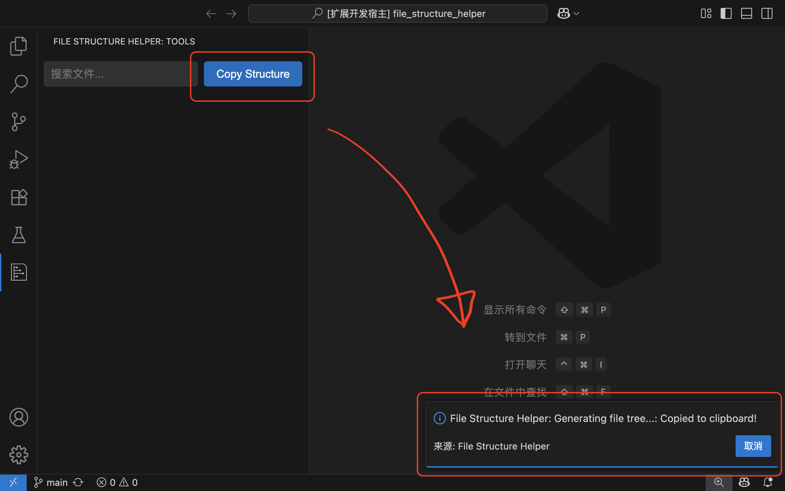
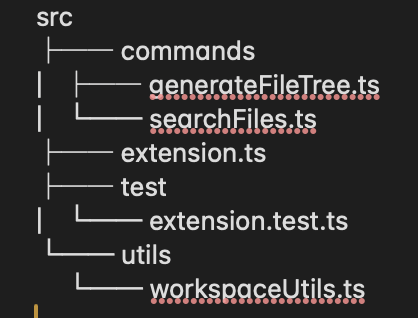
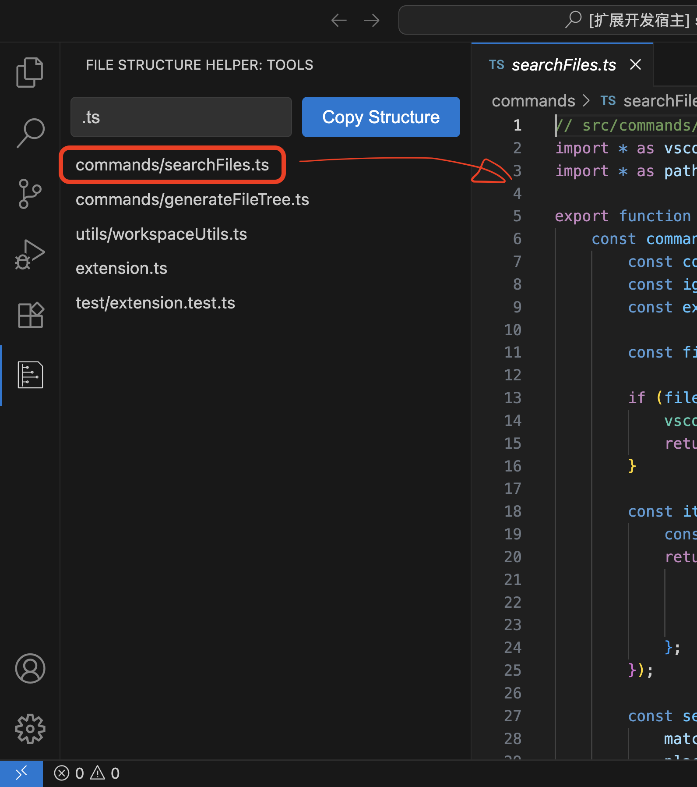

# File Structure Helper

A powerful VSCode extension that helps you copy your project’s file structure as a tree and search files by filename with ease.

一个强大的 VSCode 扩展，帮助你一键复制项目文件夹结构树，并支持按文件名快速搜索文件。

---

## Features 功能亮点

### 📋 1. Copy Project Structure Tree  
Click the "Copy Structure" button in the sidebar to instantly copy your project's folder and file structure as a tree to the clipboard.  
You can easily share this structure with others or paste it into documentation, issues, or AI tools.

点击侧边栏的 “Copy Structure” 按钮，即可一键将当前项目的文件夹结构树复制到剪贴板。  
你可以方便地将结构树粘贴到文档、工单或 AI 工具中，便于协作和沟通。

*Above: Click the button to copy the structure tree to clipboard*  
*上图：点击按钮即可复制结构树到剪贴板*

---

#### Example Output 结构树示例

The copied structure is clear and easy to read, perfect for sharing with teammates or AI assistants.

复制到剪贴板的结构树清晰易读，非常适合与团队成员或 AI 助手共享。

---

### 🔍 2. Search Files by Name  
Use the search bar in the sidebar to quickly find files by typing part of the filename.  
Click any result to instantly open the file in the editor.

在侧边栏的搜索框中输入文件名（支持模糊匹配），即可快速查找项目中的文件。  
点击搜索结果即可立即跳转并打开对应文件。

*Above: Search for files and click to open them*  
*上图：搜索文件并点击跳转到对应文件*

---

## How to Use 使用方法

1. **Open the sidebar** and find the "File Structure Helper" icon.
2. **To copy the structure tree:** Click the "Copy Structure" button. The tree will be copied to your clipboard and can be pasted anywhere.
3. **To search files:** Type part of the filename in the search bar. Click any result to open the file.

1. **打开侧边栏**，点击 “File Structure Helper” 图标。
2. **复制结构树：** 点击 “Copy Structure” 按钮，结构树会自动复制到剪贴板，可随处粘贴。
3. **搜索文件：** 在搜索框输入文件名（支持模糊搜索），点击结果即可打开文件。

---

## Why File Structure Helper? 为什么选择本插件？

- **Boosts productivity** for developers, technical writers, and AI users.
- **Simple, intuitive UI** with zero learning curve.
- **Perfect for sharing project context** in issues, documentation, or with LLMs.

- **极大提升开发、文档和 AI 场景下的效率**
- **界面简洁，零学习成本**
- **非常适合在工单、文档或大模型场景下共享项目结构**

---

## Extension Settings 插件设置

You can configure ignore patterns, max depth, and whether to include hidden files in the structure tree via VSCode settings.

你可以在 VSCode 设置中自定义结构树的忽略规则、最大深度和是否包含隐藏文件。

---

## Feedback & Issues 反馈与问题

If you have any suggestions or encounter any issues, feel free to open an issue on GitHub. https://github.com/UVCofficial/FileStructureHelper

如有建议或遇到问题，欢迎在 GitHub 提交 issue。 https://github.com/UVCofficial/FileStructureHelper

---

**Enjoy coding with File Structure Helper!**  
**祝你用 File Structure Helper 编码愉快！**
